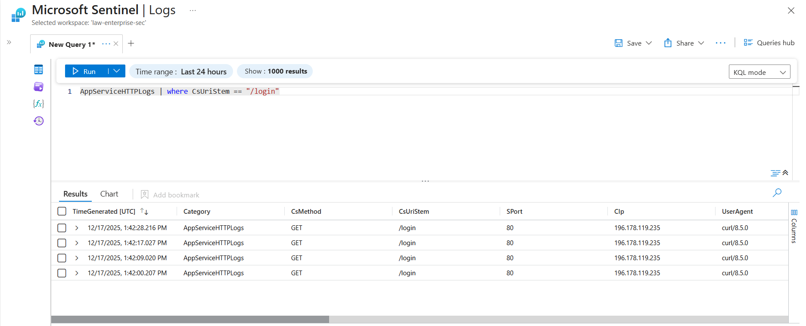

# 🛡️ Enterprise DevSecOps Platform & SOC Automation

---

## 📖 Executive Summary

This project implements an enterprise-grade DevSecOps platform with an integrated Security Operations Center (SOC) workflow on Microsoft Azure.

Unlike basic CI/CD demos, this platform enforces security gates, infrastructure immutability, and real-time threat detection. It demonstrates the ability to build, secure, monitor, and actively defend cloud workloads against real attack behavior.

This project is aligned with 2025 DevSecOps Engineer and Cloud Security Engineer role expectations.

---

## 🎯 Key Capabilities

- Infrastructure as Code (IaC) using Terraform
- Secure CI/CD with GitHub Actions and enforced vulnerability scanning
- Trivy security gate blocking vulnerable container images
- Container hardening with non-root execution
- Centralized logging with Azure Log Analytics
- Real-time threat detection using Microsoft Sentinel (SIEM)
- Brute-force attack detection on application endpoints
- Real operational evidence (pipeline success + SOC telemetry)

---

## 🏗️ Architecture Overview

Developer → GitHub → GitHub Actions → Docker Build → Trivy Scan → Terraform Apply  
Azure Container Registry → Azure Web App (Hardened Container)  
Azure Web App → Log Analytics → Azure Sentinel  

Public users access the app via HTTPS  
Attackers attempt brute-force attacks on /login  
Sentinel detects abnormal behavior and alerts the analyst

---

## 🔐 Security Implementation

### Supply Chain Security (Trivy)

Every commit triggers an automated container vulnerability scan.  
If HIGH or CRITICAL CVEs are found, the pipeline fails immediately.

---

### Container Hardening

The application runs as a non-root user with a minimal base image.

---

### SOC & Threat Detection (Azure Sentinel)

HTTP access logs are streamed into Azure Log Analytics.  
Sentinel is used to detect brute-force attempts against the /login endpoint.

---

## 📸 Operational Evidence

### CI/CD Pipeline – Secure Deployment Success

---

### SOC Detection – Brute-Force Attack Identified

---

## 🧪 What This Project Proves to Recruiters

- Secure infrastructure provisioning
- CI/CD security enforcement
- Real SOC detection logic
- Understanding of attacker behavior
- Enterprise cloud operational maturity

---

## 🧰 Technology Stack

Cloud: Microsoft Azure  
IaC: Terraform  
CI/CD: GitHub Actions  
Containers: Docker  
Security Scan: Trivy  
SIEM: Azure Sentinel  
Logging: Azure Log Analytics  
Application: Python (Flask)

---

Engineered by Raslen Jendoubi  
DevSecOps Engineer | Cloud Security Engineer  
https://github.com/raslen-jendoubi
